title: Symfony forms
name: sflive_page
class: animation-fade
layout: true

<!-- This slide will serve as the base layout for all your slides -->
.bottom-bar[
 .bottom-text[Deep dive into the form component]
]
---

class: impact

# {{title}}
## Deep dive into the form component

---

 
 
<strong>Laurent VOULLEMIER</strong>
 
 

 
 
<strong>@lvodev</strong>

---

class: section

# Some background

---

class: thesis

# The Form component

Created by Bernhard Schussek (@Webmozart)  
  
Subject of his thesis:

"An algorithm and architecture for server-side  
processing of model-bound compositional web forms"

https://webmozart.io/files/bsc-thesis.pdf

---

class: aim

# Aim of the architecture

- maximizes reusability of forms by abstracting their individual components,
  
- allows to compose such components to create new components of a higher complexity,
  
- reduces the effects of crosscutting to a minimum and
  
- provides an integration with the application’s domain model (model binding).

(© Bernhard Schussek, excerpt from his thesis)

---

class: section

# Let's go

---

# Form handling is simple

.center[.handling_img[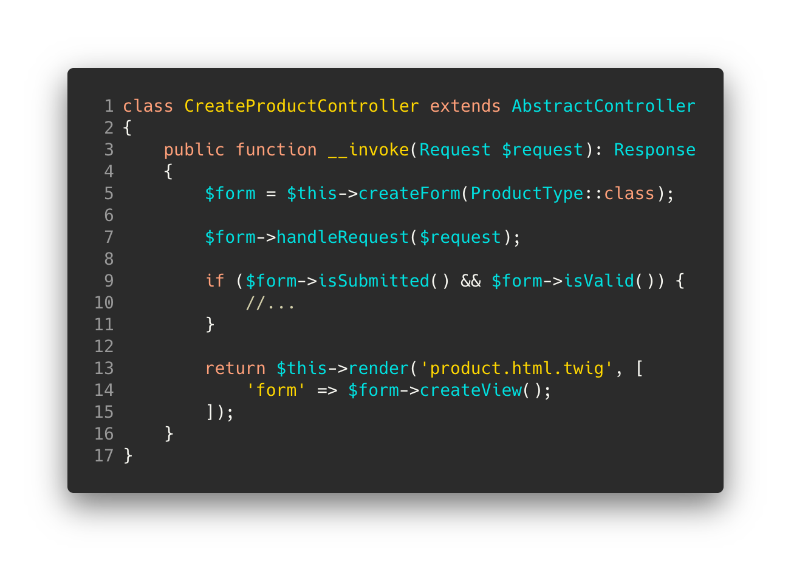]]

???
https://carbon.now.sh/?bg=rgba%28243%2C243%2C243%2C0%29&t=a11y-dark&wt=none&l=text%2Fx-php&ds=true&dsyoff=10px&dsblur=26px&wc=false&wa=true&pv=56px&ph=56px&ln=true&fl=1&fm=Hack&fs=14px&lh=133%25&si=false&es=2x&wm=false&code=class%2520CreateProductController%2520extends%2520AbstractController%250A%257B%250A%2520%2520%2520%2520public%2520function%2520__invoke%28Request%2520%2524request%29%253A%2520Response%250A%2520%2520%2520%2520%257B%250A%2520%2520%2520%2520%2520%2520%2520%2520%2524form%2520%253D%2520%2524this-%253EcreateForm%28ProductType%253A%253Aclass%29%253B%250A%2520%2520%2520%2520%2520%2520%250A%2520%2520%2520%2520%2520%2520%2520%2520%2524form-%253EhandleRequest%28%2524request%29%253B%250A%2520%2520%2520%2520%2520%2520%250A%2520%2520%2520%2520%2520%2520%2520%2520if%2520%28%2524form-%253EisSubmitted%28%29%2520%2526%2526%2520%2524form-%253EisValid%28%29%29%2520%257B%250A%2520%2520%2520%2520%2520%2520%2520%2520%2520%2520%2520%2520%252F%252F...%250A%2520%2520%2520%2520%2520%2520%2520%2520%257D%250A%2520%2520%2520%2520%2520%2520%250A%2520%2520%2520%2520%2520%2520%2520%2520return%2520%2524this-%253Erender%28%27product.html.twig%27%252C%2520%255B%250A%2520%2520%2520%2520%2520%2520%2520%2520%2520%2520%2520%2520%27form%27%2520%253D%253E%2520%2524form-%253EcreateView%28%29%253B%250A%2520%2520%2520%2520%2520%2520%2520%2520%255D%29%253B%250A%2520%2520%2520%2520%257D%2520%2520%250A%257D

---

class: section2

# But...  What is happening under the hood ?

---

class: section

# Form creation

---

# Form factory

.factory_img[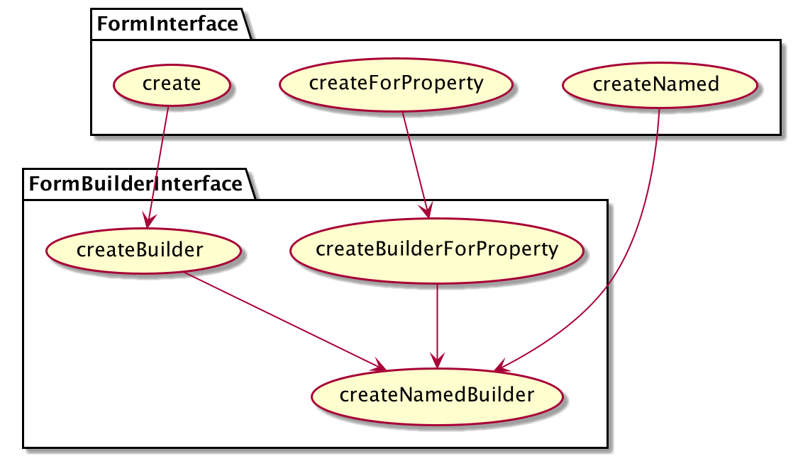]

---

class: formfactory_needs

# Form factory

Form factory needs:

- **ResolvedFormTypes**: wrappers around *FormTypes* that have knowledge of their parents and their type extensions.

- **FormTypeGuesser**: when the type isn't provided, allows to guess form type and some view settings based on metadata (ex: *DoctrineOrmTypeGuesser*, *ValidatorTypeGuesser*).

The **FormRegistry** provides these elements.

---

# Form registry

.formregistry[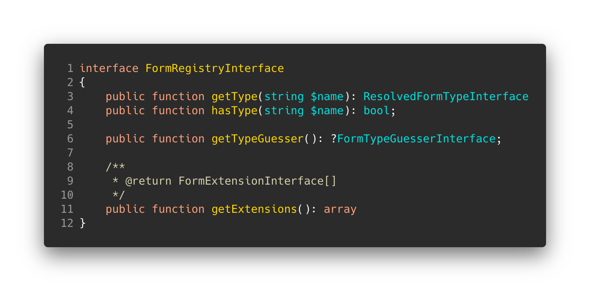]

???
https://carbon.now.sh/?bg=rgba%28243%2C243%2C243%2C0%29&t=a11y-dark&wt=none&l=text%2Fx-php&ds=true&dsyoff=10px&dsblur=26px&wc=false&wa=true&pv=56px&ph=56px&ln=true&fl=1&fm=Hack&fs=14px&lh=133%25&si=false&es=2x&wm=false&code=interface%2520FormRegistryInterface%250A%257B%250A%2520%2520%2520%2520public%2520function%2520getType%28string%2520%2524name%29%253A%2520ResolvedFormTypeInterface%250A%2520%2520%2520%2520public%2520function%2520hasType%28string%2520%2524name%29%253A%2520bool%253B%250A%2520%2520%250A%2520%2520%2520%2520public%2520function%2520getTypeGuesser%28%29%253A%2520%253FFormTypeGuesserInterface%253B%250A%250A%2520%2520%2520%2520%252F**%250A%2520%2520%2520%2520%2520*%2520%2540return%2520FormExtensionInterface%255B%255D%250A%2520%2520%2520%2520%2520*%252F%250A%2520%2520%2509public%2520function%2520getExtensions%28%29%253A%2520array%250A%257D

---

# Resolved form type

.resolved1[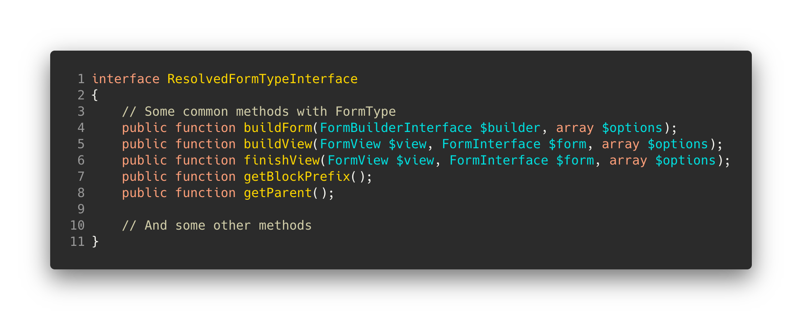]

???
https://carbon.now.sh/?bg=rgba%28243%2C243%2C243%2C0%29&t=a11y-dark&wt=none&l=text%2Fx-php&ds=true&dsyoff=10px&dsblur=26px&wc=false&wa=true&pv=56px&ph=56px&ln=true&fl=1&fm=Hack&fs=14px&lh=133%25&si=false&es=2x&wm=false&code=interface%2520ResolvedFormTypeInterface%250A%257B%250A%2520%2520%2520%2520%252F%252F%2520Some%2520common%2520methods%2520with%2520FormType%250A%2520%2520%2520%2520public%2520function%2520buildForm%28FormBuilderInterface%2520%2524builder%252C%2520array%2520%2524options%29%253B%250A%2520%2520%2520%2520public%2520function%2520buildView%28FormView%2520%2524view%252C%2520FormInterface%2520%2524form%252C%2520array%2520%2524options%29%253B%250A%2520%2520%2520%2520public%2520function%2520finishView%28FormView%2520%2524view%252C%2520FormInterface%2520%2524form%252C%2520array%2520%2524options%29%253B%250A%2520%2520%2520%2520public%2520function%2520getBlockPrefix%28%29%253B%250A%2520%2520%2520%2520public%2520function%2520getParent%28%29%253B%250A%250A%2520%2520%2520%2520%252F%252F%2520And%2520some%2520other%2520methods%250A%257D

---

# Resolved form type

.resolved2[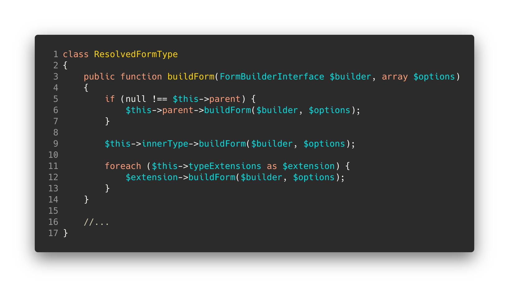]

???
https://carbon.now.sh/?bg=rgba%28243%2C243%2C243%2C0%29&t=a11y-dark&wt=none&l=text%2Fx-php&ds=true&dsyoff=10px&dsblur=26px&wc=false&wa=true&pv=56px&ph=56px&ln=true&fl=1&fm=Hack&fs=14px&lh=133%25&si=false&es=2x&wm=false&code=class%2520ResolvedFormType%250A%257B%250A%2520%2520%2520%2520public%2520function%2520buildForm%28FormBuilderInterface%2520%2524builder%252C%2520array%2520%2524options%29%250A%2520%2520%2520%2520%257B%250A%2520%2520%2520%2520%2520%2520%2520%2520if%2520%28null%2520%21%253D%253D%2520%2524this-%253Eparent%29%2520%257B%250A%2520%2520%2520%2520%2520%2520%2520%2520%2520%2520%2520%2520%2524this-%253Eparent-%253EbuildForm%28%2524builder%252C%2520%2524options%29%253B%250A%2520%2520%2520%2520%2520%2520%2520%2520%257D%250A%250A%2520%2520%2520%2520%2520%2520%2520%2520%2524this-%253EinnerType-%253EbuildForm%28%2524builder%252C%2520%2524options%29%253B%250A%250A%2520%2520%2520%2520%2520%2520%2520%2520foreach%2520%28%2524this-%253EtypeExtensions%2520as%2520%2524extension%29%2520%257B%250A%2520%2520%2520%2520%2520%2520%2520%2520%2520%2520%2520%2520%2524extension-%253EbuildForm%28%2524builder%252C%2520%2524options%29%253B%250A%2520%2520%2520%2520%2520%2520%2520%2520%257D%250A%2520%2520%2520%2520%257D%250A%2520%2520%250A%2520%2520%2520%2520%252F%252F...%250A%257D

---

# Resolved form type

.resolved3[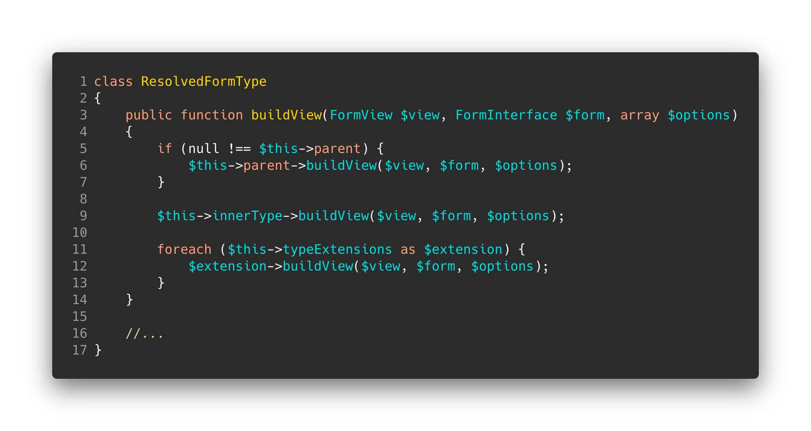]

???
https://carbon.now.sh/?bg=rgba%28243%2C243%2C243%2C0%29&t=a11y-dark&wt=none&l=text%2Fx-php&ds=true&dsyoff=10px&dsblur=26px&wc=false&wa=true&pv=56px&ph=56px&ln=true&fl=1&fm=Hack&fs=14px&lh=133%25&si=false&es=2x&wm=false&code=class%2520ResolvedFormType%250A%257B%250A%2520%2520%2520%2520public%2520function%2520buildView%28FormView%2520%2524view%252C%2520FormInterface%2520%2524form%252C%2520array%2520%2524options%29%250A%2520%2520%2520%2520%257B%250A%2520%2520%2520%2520%2520%2520%2520%2520if%2520%28null%2520%21%253D%253D%2520%2524this-%253Eparent%29%2520%257B%250A%2520%2520%2520%2520%2520%2520%2520%2520%2520%2520%2520%2520%2524this-%253Eparent-%253EbuildView%28%2524view%252C%2520%2524form%252C%2520%2524options%29%253B%250A%2520%2520%2520%2520%2520%2520%2520%2520%257D%250A%250A%2520%2520%2520%2520%2520%2520%2520%2520%2524this-%253EinnerType-%253EbuildView%28%2524view%252C%2520%2524form%252C%2520%2524options%29%253B%250A%250A%2520%2520%2520%2520%2520%2520%2520%2520foreach%2520%28%2524this-%253EtypeExtensions%2520as%2520%2524extension%29%2520%257B%250A%2520%2520%2520%2520%2520%2520%2520%2520%2520%2520%2520%2520%2524extension-%253EbuildView%28%2524view%252C%2520%2524form%252C%2520%2524options%29%253B%250A%2520%2520%2520%2520%2520%2520%2520%2520%257D%250A%2520%2520%2520%2520%257D%250A%2520%2520%250A%2520%2520%2520%2520%252F%252F...%250A%257D
---

# Resolved form type

.resolved3[]

???
https://carbon.now.sh/?bg=rgba%28243%2C243%2C243%2C0%29&t=a11y-dark&wt=none&l=text%2Fx-php&ds=true&dsyoff=10px&dsblur=26px&wc=false&wa=true&pv=56px&ph=56px&ln=true&fl=1&fm=Hack&fs=14px&lh=133%25&si=false&es=2x&wm=false&code=class%2520ResolvedFormType%250A%257B%250A%2520%2520%2520%2520public%2520function%2520finishView%28FormView%2520%2524view%252C%2520FormInterface%2520%2524form%252C%2520array%2520%2524options%29%250A%2520%2520%2520%2520%257B%250A%2520%2520%2520%2520%2520%2520%2520%2520if%2520%28null%2520%21%253D%253D%2520%2524this-%253Eparent%29%2520%257B%250A%2520%2520%2520%2520%2520%2520%2520%2520%2520%2520%2520%2520%2524this-%253Eparent-%253EfinishView%28%2524view%252C%2520%2524form%252C%2520%2524options%29%253B%250A%2520%2520%2520%2520%2520%2520%2520%2520%257D%250A%250A%2520%2520%2520%2520%2520%2520%2520%2520%2524this-%253EinnerType-%253EfinishView%28%2524view%252C%2520%2524form%252C%2520%2524options%29%253B%250A%250A%2520%2520%2520%2520%2520%2520%2520%2520foreach%2520%28%2524this-%253EtypeExtensions%2520as%2520%2524extension%29%2520%257B%250A%2520%2520%2520%2520%2520%2520%2520%2520%2520%2520%2520%2520%2524extension-%253EfinishView%28%2524view%252C%2520%2524form%252C%2520%2524options%29%253B%250A%2520%2520%2520%2520%2520%2520%2520%2520%257D%250A%2520%2520%2520%2520%257D%250A%2520%2520%250A%2520%2520%2520%2520%252F%252F...%250A%257D

---

# Resolved form type

.resolved4[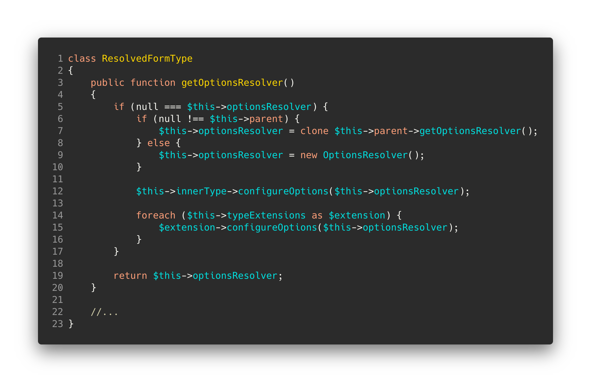]

???
https://carbon.now.sh/?bg=rgba%28243%2C243%2C243%2C0%29&t=a11y-dark&wt=none&l=text%2Fx-php&ds=true&dsyoff=10px&dsblur=26px&wc=false&wa=true&pv=56px&ph=56px&ln=true&fl=1&fm=Hack&fs=14px&lh=133%25&si=false&es=2x&wm=false&code=class%2520ResolvedFormType%250A%257B%250A%2520%2520%2520%2520public%2520function%2520getOptionsResolver%28%29%250A%2520%2520%2520%2520%257B%250A%2520%2520%2520%2520%2520%2520%2520%2520if%2520%28null%2520%253D%253D%253D%2520%2524this-%253EoptionsResolver%29%2520%257B%250A%2520%2520%2520%2520%2520%2520%2520%2520%2520%2520%2520%2520if%2520%28null%2520%21%253D%253D%2520%2524this-%253Eparent%29%2520%257B%250A%2520%2520%2520%2520%2520%2520%2520%2520%2520%2520%2520%2520%2520%2520%2520%2520%2524this-%253EoptionsResolver%2520%253D%2520clone%2520%2524this-%253Eparent-%253EgetOptionsResolver%28%29%253B%250A%2520%2520%2520%2520%2520%2520%2520%2520%2520%2520%2520%2520%257D%2520else%2520%257B%250A%2520%2520%2520%2520%2520%2520%2520%2520%2520%2520%2520%2520%2520%2520%2520%2520%2524this-%253EoptionsResolver%2520%253D%2520new%2520OptionsResolver%28%29%253B%250A%2520%2520%2520%2520%2520%2520%2520%2520%2520%2520%2520%2520%257D%250A%250A%2520%2520%2520%2520%2520%2520%2520%2520%2520%2520%2520%2520%2524this-%253EinnerType-%253EconfigureOptions%28%2524this-%253EoptionsResolver%29%253B%250A%250A%2520%2520%2520%2520%2520%2520%2520%2520%2520%2520%2520%2520foreach%2520%28%2524this-%253EtypeExtensions%2520as%2520%2524extension%29%2520%257B%250A%2520%2520%2520%2520%2520%2520%2520%2520%2520%2520%2520%2520%2520%2520%2520%2520%2524extension-%253EconfigureOptions%28%2524this-%253EoptionsResolver%29%253B%250A%2520%2520%2520%2520%2520%2520%2520%2520%2520%2520%2520%2520%257D%250A%2520%2520%2520%2520%2520%2520%2520%2520%257D%250A%250A%2520%2520%2520%2520%2520%2520%2520%2520return%2520%2524this-%253EoptionsResolver%253B%250A%2520%2520%2520%2520%257D%250A%2520%2520%250A%2520%2520%2520%2520%252F%252F...%250A%257D
---

class: section

# Setting initial data

---

# How data initialization is triggered

.setdata_img[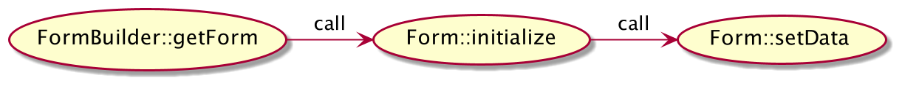]

- **Form::initialize** is only called on the root form
- **Form::setData** uses the content of the *data* option or the value passed to the FormFactory creation method otherwise.

---

class: setdata

# setData actions

- Dispatch *PreSetDataEvent* with the provided data (model data) and retrieve eventually modified model data

- Data transformer are used (if availables):
  
.setdata_transformers[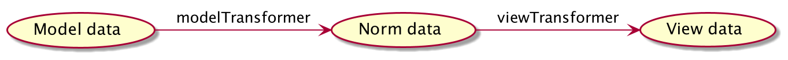]

- Compound forms use `DataMapperInterface::mapDataToForms` to set data on child forms

- Dispatch *PostSetDataEvent* with the provided data (model data)

???
No transformers for root form
DataMapper = PropertyPathMapper

---

# Map data to form

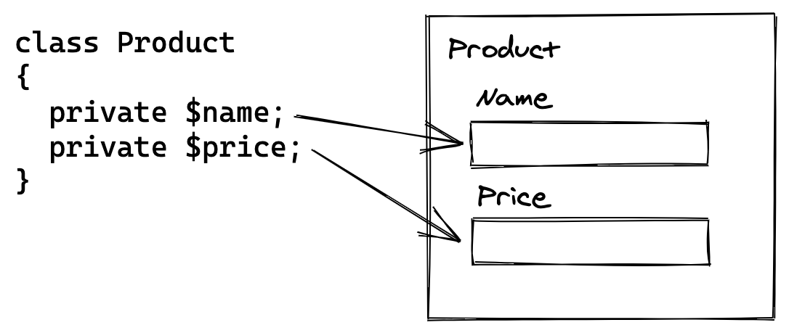

---

# PropertyPathMapper

.mapper1_img[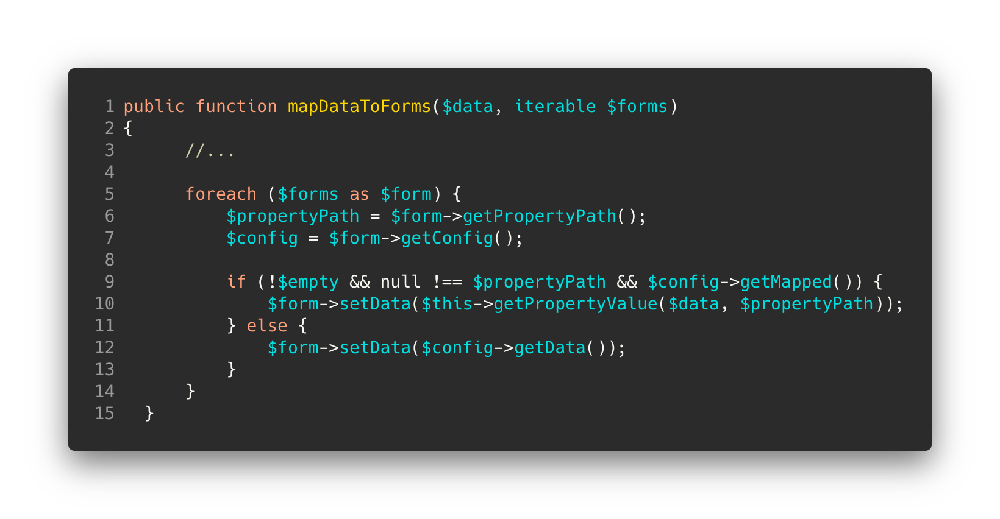]

???
https://carbon.now.sh/?bg=rgba%28243%2C243%2C243%2C0%29&t=a11y-dark&wt=none&l=text%2Fx-php&ds=true&dsyoff=10px&dsblur=26px&wc=false&wa=true&pv=56px&ph=56px&ln=true&fl=1&fm=Hack&fs=14px&lh=133%25&si=false&es=2x&wm=false&code=public%2520function%2520mapDataToForms%28%2524data%252C%2520iterable%2520%2524forms%29%250A%257B%250A%2520%2520%2520%2520%2520%2520%252F%252F...%250A%2520%2520%250A%2520%2520%2520%2520%2520%2520foreach%2520%28%2524forms%2520as%2520%2524form%29%2520%257B%250A%2520%2520%2520%2520%2520%2520%2520%2520%2520%2520%2524propertyPath%2520%253D%2520%2524form-%253EgetPropertyPath%28%29%253B%250A%2520%2520%2520%2520%2520%2520%2520%2520%2520%2520%2524config%2520%253D%2520%2524form-%253EgetConfig%28%29%253B%250A%250A%2520%2520%2520%2520%2520%2520%2520%2520%2520%2520if%2520%28%21%2524empty%2520%2526%2526%2520null%2520%21%253D%253D%2520%2524propertyPath%2520%2526%2526%2520%2524config-%253EgetMapped%28%29%29%2520%257B%250A%2520%2520%2520%2520%2520%2520%2520%2520%2520%2520%2520%2520%2520%2520%2524form-%253EsetData%28%2524this-%253EgetPropertyValue%28%2524data%252C%2520%2524propertyPath%29%29%253B%250A%2520%2520%2520%2520%2520%2520%2520%2520%2520%2520%257D%2520else%2520%257B%250A%2520%2520%2520%2520%2520%2520%2520%2520%2520%2520%2520%2520%2520%2520%2524form-%253EsetData%28%2524config-%253EgetData%28%29%29%253B%250A%2520%2520%2520%2520%2520%2520%2520%2520%2520%2520%257D%250A%2520%2520%2520%2520%2520%2520%257D%250A%2520%2520%257D

---

class: section

# Submitting data

---

class: request_handler1

# Request handler

A request handler (`RequestHandlerInterface` implementation) retrieve data from the request (depending on the HTTP method).

- `RequestHandlerInterface::handleRequest` is called by `Form::handleRequest`
  
- `RequestHandlerInterface::handleRequest` calls `Form::submit` if request has data related to the form

---

class: request_handler2

# Request handler

The Form component currently provides 2 implementations of `RequestHandlerInterface`:
- `NativeRequestHandler` that retrieves request data from php superglobals (*$_GET*, *$_POST*...)
  
- `HttpFoundationRequestHandler` that retrieves request data from an HttpFoundation request object

.note[
*Note: a pull request is opened on the `psr-http-message-bridge` to introduce a 
`Psr7RequestHandler`.*
]

---

class: submit1

# Submit

- Dispatch *PreSubmitEvent* with the submitted data (data provided by the request handler) and retrieve eventually modified data

- Call `submit` method on each form child with the submitted data for this field

- Submitted data can be modified by a form child data transformer; `DataMapperInterface::mapFormsToData` is used to merge this transformed data to submitted data
  
---

# Map form to data

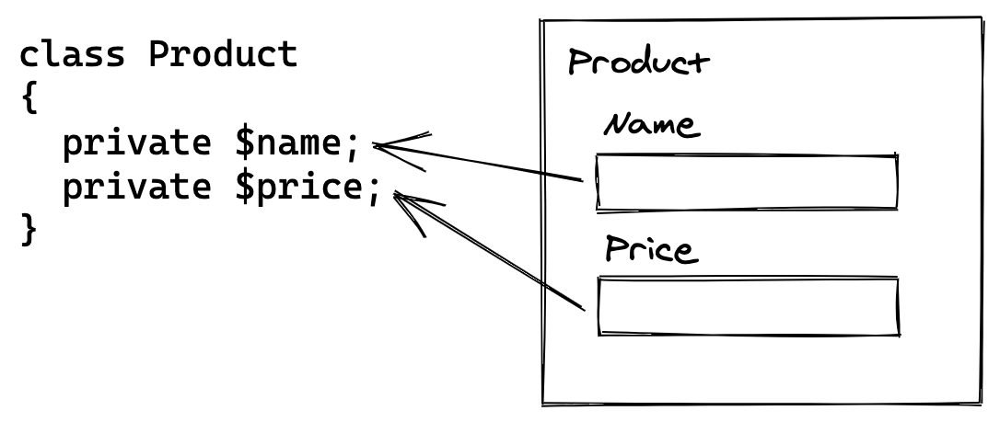

---

# PropertyPathMapper

.mapper2_img[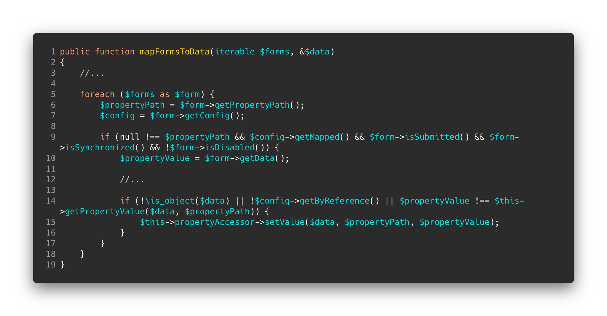]

???
https://carbon.now.sh/?bg=rgba%28243%2C243%2C243%2C0%29&t=a11y-dark&wt=none&l=text%2Fx-php&ds=true&dsyoff=10px&dsblur=26px&wc=false&wa=true&pv=56px&ph=56px&ln=true&fl=1&fm=Hack&fs=14px&lh=133%25&si=false&es=2x&wm=false&code=public%2520function%2520mapFormsToData%28iterable%2520%2524forms%252C%2520%2526%2524data%29%250A%257B%250A%2520%2520%2520%2520%252F%252F...%250A%2520%2520%250A%2520%2520%2520%2520foreach%2520%28%2524forms%2520as%2520%2524form%29%2520%257B%250A%2520%2520%2520%2520%2520%2520%2520%2520%2524propertyPath%2520%253D%2520%2524form-%253EgetPropertyPath%28%29%253B%250A%2520%2520%2520%2520%2520%2520%2520%2520%2524config%2520%253D%2520%2524form-%253EgetConfig%28%29%253B%250A%250A%2520%2520%2520%2520%2520%2520%2520%2520if%2520%28null%2520%21%253D%253D%2520%2524propertyPath%2520%2526%2526%2520%2524config-%253EgetMapped%28%29%2520%2526%2526%2520%2524form-%253EisSubmitted%28%29%2520%2526%2526%2520%2524form-%253EisSynchronized%28%29%2520%2526%2526%2520%21%2524form-%253EisDisabled%28%29%29%2520%257B%250A%2520%2520%2520%2520%2520%2520%2520%2520%2520%2520%2520%2520%2524propertyValue%2520%253D%2520%2524form-%253EgetData%28%29%253B%250A%2520%2520%2520%2520%2520%2520%2520%2520%2520%2520%2520%2520%2520%2520%2520%2520%250A%2520%2520%2520%2520%2520%2520%2520%2520%2520%2520%2520%2520%252F%252F...%250A%250A%2520%2520%2520%2520%2520%2520%2520%2520%2520%2520%2520%2520if%2520%28%21%255Cis_object%28%2524data%29%2520%257C%257C%2520%21%2524config-%253EgetByReference%28%29%2520%257C%257C%2520%2524propertyValue%2520%21%253D%253D%2520%2524this-%253EgetPropertyValue%28%2524data%252C%2520%2524propertyPath%29%29%2520%257B%250A%2520%2520%2520%2520%2520%2520%2520%2520%2520%2520%2520%2520%2520%2520%2520%2520%2524this-%253EpropertyAccessor-%253EsetValue%28%2524data%252C%2520%2524propertyPath%252C%2520%2524propertyValue%29%253B%250A%2520%2520%2520%2520%2520%2520%2520%2520%2520%2520%2520%2520%257D%250A%2520%2520%2520%2520%2520%2520%2520%2520%257D%250A%2520%2520%2520%2520%257D%250A%257D
---

class: submit2

# Submit

- Submitted data can be transformed:
.submit_transformers1[]
- Dispatch *SubmitEvent* with the norm data and retrieve eventually modified data

- Data can be transformed again:
.submit_transformers2[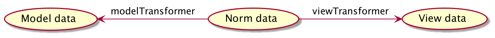]
- Dispatch *PostSubmitEvent* with the view data

---

class: section

# Bonus: extensions

---

# Form Extension

.extension_img[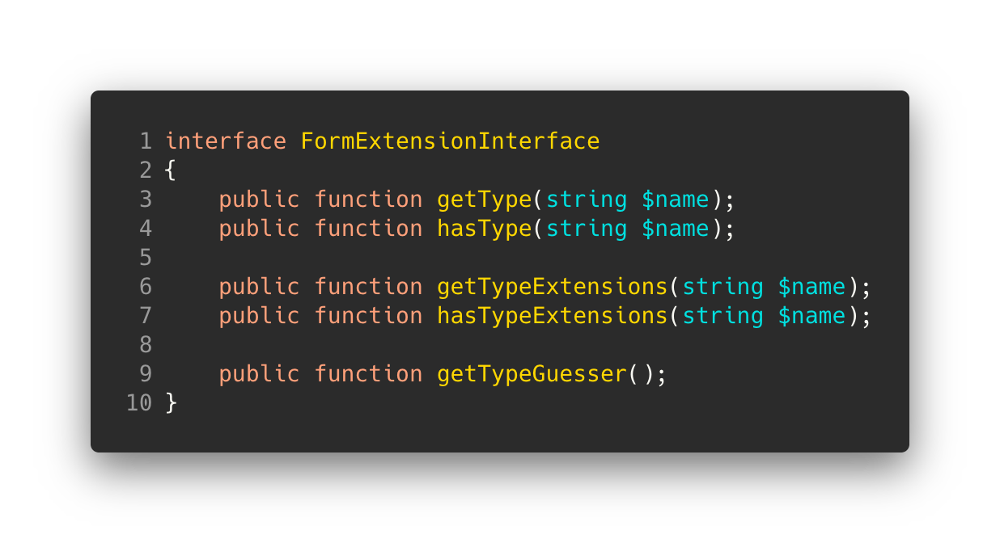]

???
https://carbon.now.sh/?bg=rgba%28243%2C243%2C243%2C0%29&t=a11y-dark&wt=none&l=text%2Fx-php&ds=true&dsyoff=10px&dsblur=26px&wc=false&wa=true&pv=56px&ph=56px&ln=true&fl=1&fm=Hack&fs=14px&lh=133%25&si=false&es=2x&wm=false&code=interface%2520FormExtensionInterface%250A%257B%250A%2520%2520%2520%2520public%2520function%2520getType%28string%2520%2524name%29%253B%250A%2509public%2520function%2520hasType%28string%2520%2524name%29%253B%250A%2520%2520%2520%250A%2520%2520%2520%2520public%2520function%2520getTypeExtensions%28string%2520%2524name%29%253B%250A%2509public%2520function%2520hasTypeExtensions%28string%2520%2524name%29%253B%250A%250A%2520%2520%2520%2520public%2520function%2520getTypeGuesser%28%29%253B%250A%257D

---

class: builtin

# Many built-in extensions

- CoreExtension: built-in types
- CsrfExtension: csrf protection
- ValidatorExtension: constraints integration
- DependencyInjectionExtension: A compiler pass register here:
  - FormTypes services
  - FormTypeExtensions services
  - Guessers services
- ...

---

class: section

# Bonus: guessers

---

class: guessers1

# What are guessers ?

Guessers allow to assume a form type based on the underlying object properties.

They are only used **if no form type is provided**.

In addition to the form type; they can guess:
- the html required property
- the html maxlength property
- the html pattern property

---

class: guessers2

# How guessers work ?

Only one guesser is used for an application (*ChainGuesser* allows to use several guessers).

Each guesser can do assumptions on a field. Guessers tie confidences (low, medium, high, very high) to their assumptions.

ChainGuesser returns the assumption with the hightest confidence.

---

class: section2

# Questions ?
